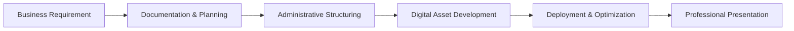

<!-- ========================================================= -->
<!-- GitHub Profile README | Alfin Cahya Putra Wibowo -->
<!-- Banking Administration | Business Support | Web Development -->
<!-- ========================================================= -->

<div align="center">

# Hi, I'm **Alfin Cahya Putra Wibowo**

### Banking Administration · Business Support · Web Development · Digital Operations

I build structured business administration workflows, corporate documentation systems, and practical digital solutions for modern business operations.

<br>

<a href="https://acpbusiness-support.my.id/">
  
</a>
<a href="https://sierre1337.github.io/portfolio/">
  
</a>
<a href="https://github.com/sierre1337">
  
</a>
<a href="https://linkedin.com/in/alfnchyaptra">
  
</a>
<a href="https://instagram.com/alfnchyaptra">
  
</a>
<a href="mailto:acpbusinesssupport@gmail.com">
  
</a>

</div>

---

## Executive Profile

I am a **business administration and digital support professional** with experience across **banking administration, corporate documentation, financial operations, business legalization, and web-based business support**.

My work combines precise administrative execution with practical digital tools such as **HTML, CSS, JavaScript, GitHub, Vercel, Visual Studio Code, OSS RBA, Coretax, Microsoft Office, Canva, Google Workspace, and AI-assisted workflows**.

I focus on helping individuals, entrepreneurs, and companies manage business processes more efficiently through structured documentation, reliable administrative systems, and clean digital presentation.

---

## Professional Positioning

```text
Banking Administration
Corporate Documentation
Financial Operations
Business Legalization
OSS RBA & Coretax Administration
Company Profile Development
Landing Page & Portfolio Website Development
Digital Business Support
Administrative Workflow Structuring
AI-Assisted Productivity
```

---

## Core Expertise

<table>
  <tr>
    <td width="33%" valign="top">
      <h3>Banking & Financial Administration</h3>
      <ul>
        <li>Corporate banking administration</li>
        <li>Financial transaction documentation</li>
        <li>SWIFT-related administrative support</li>
        <li>Multi-bank account documentation</li>
        <li>Invoice and payment document preparation</li>
        <li>Corporate correspondence and filing</li>
      </ul>
    </td>
    <td width="33%" valign="top">
      <h3>Business Administration & Legalization</h3>
      <ul>
        <li>Business registration documentation</li>
        <li>OSS RBA support</li>
        <li>NIB and business licensing assistance</li>
        <li>Coretax administration</li>
        <li>Company profile preparation</li>
        <li>Corporate data management</li>
      </ul>
    </td>
    <td width="33%" valign="top">
      <h3>Digital Business Support</h3>
      <ul>
        <li>Landing page development</li>
        <li>Portfolio website development</li>
        <li>Company website setup</li>
        <li>GitHub repository management</li>
        <li>Vercel deployment</li>
        <li>Domain and hosting setup</li>
      </ul>
    </td>
  </tr>
</table>

---

## Tech Stack & Tools

### Web Development

<p>
  
  
  
</p>

### Development & Deployment

<p>
  
  
  
  
</p>

### Business, Administration & Productivity

<p>
  
  
  
  
  
  
</p>

---

## What I Build

I create and manage digital and administrative assets for professional and business needs, including:

| Category | Deliverables |
|---|---|
| Personal Branding | Portfolio websites, digital profiles, professional link hubs |
| Corporate Digital Assets | Company websites, landing pages, service pages |
| Business Documentation | Company profiles, proposals, official letters, presentation materials |
| Administration Systems | Database templates, document trackers, workflow structures |
| Legalization Support | OSS RBA, NIB, Coretax, business registration documentation |
| Digital Operations | GitHub repository setup, Vercel deployment, domain configuration |

---

## ACP Business Support

**ACP Business Support** is a professional business support initiative focused on helping individuals, entrepreneurs, and companies manage administrative, legalization, documentation, digital, and operational needs more effectively.

### Main Service Areas

```text
Business Legalization Support
Perseroan Perorangan Setup Assistance
OSS RBA Registration Support
NIB and Licensing Assistance
Coretax Administration Support
Company Profile Creation
Landing Page and Website Development
Digital Business Documentation
Administrative Database Structuring
```

<a href="https://acpbusiness-support.my.id/">
  
</a>

---

## Featured Digital Projects

### ACP Business Support Website

A corporate business support website designed to present services, company positioning, portfolio, articles, contact access, and digital business branding.

**Focus:** Business consulting, legalization support, corporate documentation, website development, and digital operations.

<a href="https://acpbusiness-support.my.id/">
  
</a>

---

### Personal Portfolio Website

A professional portfolio website presenting personal profile, work focus, digital projects, business support capabilities, and professional contact links.

**Focus:** Personal branding, professional positioning, web development, and business administration profile.

<a href="https://sierre1337.github.io/portfolio/">
  
</a>

---

## Professional Strengths

```text
Structured Thinking
Administrative Accuracy
Corporate Documentation
Digital Execution
Business Process Understanding
Problem Solving
Professional Communication
Operational Discipline
Continuous Learning
```

---

## Digital Workflow



---

## Current Focus

<table>
  <tr>
    <td width="50%" valign="top">
      <h3>Business & Administration</h3>
      <ul>
        <li>Banking administration support</li>
        <li>Corporate documentation</li>
        <li>Business legalization workflows</li>
        <li>OSS RBA and Coretax administration</li>
      </ul>
    </td>
    <td width="50%" valign="top">
      <h3>Digital Execution</h3>
      <ul>
        <li>Company website development</li>
        <li>Portfolio and landing page development</li>
        <li>GitHub Pages and Vercel deployment</li>
        <li>AI-assisted business productivity</li>
      </ul>
    </td>
  </tr>
</table>

---

## Connect With Me

<div align="center">

<a href="https://acpbusiness-support.my.id/">
  
</a>

<br><br>

<a href="https://sierre1337.github.io/portfolio/">
  
</a>

<br><br>

<a href="https://github.com/sierre1337">
  
</a>

<br><br>

<a href="https://linkedin.com/in/alfnchyaptra">
  
</a>

<br><br>

<a href="https://instagram.com/alfnchyaptra">
  
</a>

<br><br>

<a href="mailto:acpbusinesssupport@gmail.com">
  
</a>

</div>

---

<div align="center">

### Professional Administration · Digital Business Support · Practical Web Solutions

**Building structured, reliable, and modern business support systems through administration, documentation, and digital execution.**

</div>
